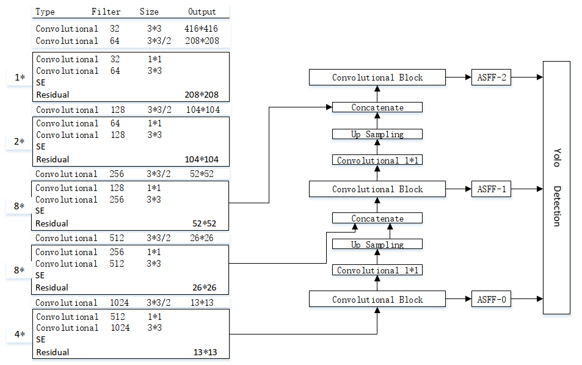

 

 > tags : object detection, darknet , yolo v3, cnn, svm, deep learning, opencv

## 关于项目
本文运用了一种基于YOLOv3的目标行为检测算法，将 YOLOv3 用
于自动识别检测工人是否佩戴安全帽。本文采用安全帽佩戴检测数据集作为该模型的输入，
建立并利用预训练模型 Darknet-53，将数据集中的图片像素调整为 416×416，然后将该数
据集输入到预训练模型 Darknet-53 网络中，采用该网络提高了检测的精度，最后，对训练
好的模型进行测试，并引入两个目标检测的评价指标分别为 recall(召回率)和 precision(精确
率)，在设置阈值 IOU=0.5 的情况下，工人佩戴安全帽的检测精确率达到 90.71%，工人未
佩戴安全帽的检测精确率为 86.66%，该系统的平均检测精度为 88.68%，召回率为 88%，
对比于 YOLOv2 模型来说，YOLOv2 的检测平均准确率为 86.52%，而 YOLOv3 的检测平
均准确率为88.68%，说明本文采用的 YOLOv3 检测效果要好于 YOLOv2。

## 模型结构
 
## 训练过程
 
## 检测效果
 
 
 
